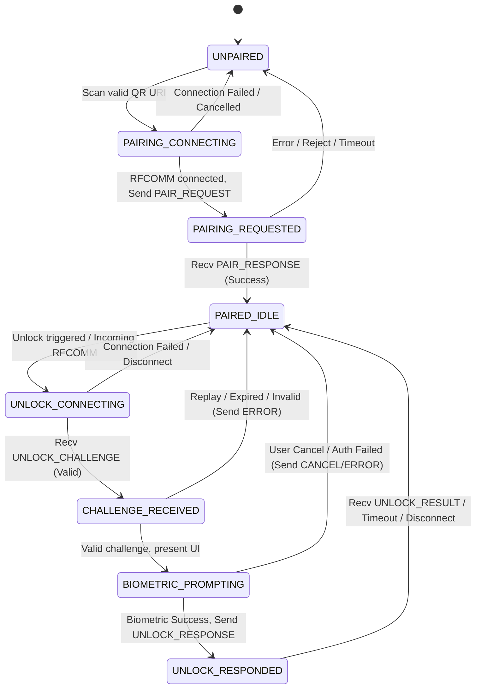

# WindowsLockPin Protocol Specification (v1)

- **Document Version**: 1.0.0
- **Status**: Phase 1 Foundation / Draft
- **Transport**: Bluetooth Classic RFCOMM
- **Fixed Service UUID**: `9b3f4a10-7c22-4e89-80b1-5d9c71a3d0f2`
- **Application ID**: `com.windowslockpin.companion`

---

## 1. Overview and Security Model

The WindowsLockPin companion protocol provides cryptographic mutual authentication between a Windows host (PC) and an Android companion device (Phone) over Bluetooth Classic RFCOMM.

### 1.1 Threat Model and Trust Boundaries
1. **OS Bluetooth Pairing vs Application Authentication**: Standard OS Bluetooth pairing provides link-layer encryption and device authorization, but does not provide end-to-end cryptographic proof of human biometric presence or mutual application identity. The WindowsLockPin protocol layers an application-level mutual cryptographic handshake over RFCOMM.
2. **Zero Windows Secrets on Phone**: The Android companion NEVER receives or stores Windows account passwords, domain credentials, DPAPI master keys, or Windows Hello PINs. The Android device acts solely as an authenticator validating a high-entropy, time-bounded challenge via biometric confirmation (`BiometricPrompt` with auth-per-use hardware-backed key).
3. **No Network Access**: The Android companion operates entirely offline without the `android.permission.INTERNET` permission.
4. **Bounded Buffers and Strict Parsing**: All frame sizes, field lengths, and URI lengths are bounded by hard limits. Malformed or oversized inputs are rejected immediately, and the transport is terminated.
5. **No Secret Logging**: Sensitive values (private keys, ephemeral shared secrets, pairing tokens, biometric confirmation tokens, challenge nonces, raw QR strings, full machine IDs) must never be logged or serialized to unencrypted storage.

---

## 2. Pairing URI Grammar

Pairing between the Windows host and the Android companion is initiated out-of-band via an on-screen QR code generated by the Windows pairing tool.

### 2.1 URI Scheme and Format
The pairing URI uses a custom scheme `wslp://` with the path `pair`:

```text
wslp://pair?v=1&pc_id=<hex>&pc_name=<string>&bt_mac=<mac>&pair_token=<b64url>&exp=<timestamp>
```

### 2.2 Parameters
| Parameter | Type | Required | Description | Constraints |
|:---|:---|:---|:---|:---|
| `v` | Integer | Yes | Protocol version | Must equal `1`. All other values are rejected. |
| `pc_id` | String | Yes | Unique host identifier | 16 to 64 hexadecimal characters `[0-9a-fA-F]`. Case-insensitive, canonicalized to lowercase. |
| `pc_name` | String | Yes | Human-readable PC name | 1 to 64 UTF-8 characters. Safe character set: `[a-zA-Z0-9 _.-]`. URL-decoded. |
| `bt_mac` | String | Yes | Bluetooth adapter MAC | Canonical 17-character colon-delimited uppercase hex format: `^([0-9A-F]{2}:){5}[0-9A-F]{2}$`. |
| `pair_token`| String | Yes | Ephemeral pairing token | High-entropy random token (minimum 16 bytes, maximum 32 bytes) encoded in unpadded Base64URL (`[0-9a-zA-Z_-]`), length 22 to 43 chars. |
| `exp` | Integer | Yes | Expiry timestamp | Unix epoch timestamp in seconds (`uint64`). Companion must reject URIs where `current_epoch_sec > exp`. Max QR lifetime is 180 seconds from generation. |

### 2.3 Strict Validation Rules
1. **Scheme**: Must be strictly `wslp`. Case-insensitive, canonicalized to lowercase.
2. **Host / Path**: Authority/host must be empty or `pair`, path must be empty or `/pair`.
3. **Total Length**: Maximum URI length is **512 bytes**. Exceeding length causes immediate rejection.
4. **Unknown Query Keys**: Any unrecognized query parameter results in rejection (strict schema).
5. **Duplicate Keys**: Any repeated query parameter results in rejection.
6. **No Missing Fields**: All six parameters (`v`, `pc_id`, `pc_name`, `bt_mac`, `pair_token`, `exp`) are mandatory.

---

## 3. Binary Framing Header

All messages over the RFCOMM stream are framed with a fixed 16-byte binary header followed by a bounded payload.

### 3.1 Frame Structure
Total maximum frame size: **8,192 bytes (8 KiB)**. Any frame declaring or transmitting more than 8,192 bytes MUST be rejected, and the underlying RFCOMM connection closed.

```text
+-----------------------+-----------------------+
|  Magic Bytes (2B)     | Version (1B) | Type (1B)|
|  0x57 0x4C ('W', 'L') |     0x01     |  MsgType |
+-----------------------+-----------------------+
|            Reserved / Flags (2B)              |
|                 0x00 0x00                     |
+-----------------------------------------------+
|               Request ID (8B)                 |
|             uint64, Big-Endian                |
+-----------------------+-----------------------+
|  Payload Length (2B)  |  Payload Data (NB)    |
|   uint16, Big-Endian  |  (0 <= N <= 8176)     |
+-----------------------+                       |
|       ... (Payload Data Continued) ...        |
+-----------------------------------------------+
```

### 3.2 Header Fields
1. **Magic Bytes** (2 bytes): `0x57 0x4C` (ASCII `'W'`, `'L'`). Identifies the WindowsLockPin protocol.
2. **Version** (1 byte): `0x01` for Protocol v1.
3. **Message Type** (1 byte):
   - `0x01`: `PAIR_REQUEST` (Companion -> Host)
   - `0x02`: `PAIR_RESPONSE` (Host -> Companion)
   - `0x03`: `UNLOCK_CHALLENGE` (Host -> Companion)
   - `0x04`: `UNLOCK_RESPONSE` (Companion -> Host)
   - `0x05`: `CANCEL` (Bidirectional)
   - `0x06`: `ERROR` (Bidirectional)
   - `0x07`: `PING` (Bidirectional keepalive)
   - `0x08`: `PONG` (Bidirectional keepalive ack)
   - `0x09`: `UNLOCK_RESULT` (Host -> Companion)
4. **Reserved / Flags** (2 bytes): Must be `0x0000` in v1. Reserved for compression/encryption flags in future extensions.
5. **Request ID** (8 bytes): Unsigned 64-bit integer (big-endian). Generated randomly by the initiator; echoed in responses.
6. **Payload Length** (2 bytes): Unsigned 16-bit integer (big-endian), `0 <= Payload Length <= 8176`.
7. **Payload Data**: Raw payload bytes matching the Message Type.

---

## 4. Message Payloads and Encodings

Payloads are encoded deterministically with length prefixes to avoid ambiguous parsing. All strings are UTF-8 encoded.

### 4.1 PAIR_REQUEST (`0x01`, Companion -> Host)
Sent by the companion immediately after establishing RFCOMM connection using credentials obtained from QR code.

| Field | Type | Bounds | Description |
|:---|:---|:---|:---|
| `device_id` | Length-prefixed string | 1-64 bytes UTF-8 | Unique Android companion installation ID (UUID). |
| `device_name` | Length-prefixed string | 1-64 bytes UTF-8 | User-friendly device model (e.g. "Xiaomi 13"). |
| `pair_token` | Length-prefixed bytes | 16-32 bytes | Pairing token binary bytes decoded from Base64URL in the QR code. |
| `client_public_key` | Length-prefixed bytes | 33-65 bytes | Uncompressed (`0x04 || X || Y`, 65B) or compressed (33B) SECP256R1 (NIST P-256) public key generated in Android Keystore. |

### 4.2 PAIR_RESPONSE (`0x02`, Host -> Companion)
Sent by the Windows host in response to `PAIR_REQUEST`.

| Field | Type | Bounds | Description |
|:---|:---|:---|:---|
| `status_code` | uint16 | 2 bytes | `0x0000` = SUCCESS; non-zero = error code. |
| `server_public_key` | Length-prefixed bytes | 33-65 bytes | SECP256R1 host public key. |
| `confirmation_tag` | Length-prefixed bytes | 32 bytes | HMAC-SHA-256 over the length-prefixed `(pc_id, device_id, client_public_key, server_public_key)` transcript. The HMAC key is derived from the high-entropy QR `pair_token` using HKDF-SHA-256. |

#### Pairing confirmation derivation

Every length below is an unsigned 16-bit big-endian byte length. Strings use strict UTF-8.

```text
pairing_salt = SHA-256(
    u16(len(pc_id)) || pc_id ||
    u16(len(device_id)) || device_id
)

K_pair = HKDF-SHA-256(
    salt = pairing_salt,
    IKM  = pair_token,
    info = "WSLP-V1-PAIRING-KEY",
    L    = 32
)

confirmation_transcript =
    "WSLP-V1-PAIR-CONFIRM\0" ||
    u16(len(pc_id)) || pc_id ||
    u16(len(device_id)) || device_id ||
    u16(len(client_public_key)) || client_public_key ||
    u16(len(server_public_key)) || server_public_key

confirmation_tag = HMAC-SHA-256(K_pair, confirmation_transcript)
```

Both peers compare the tag in constant time. After successful pairing, erase the raw `pair_token`; persist `K_pair` only in OS-protected storage (Android Keystore-wrapped storage on the companion and DPAPI/ACL-protected storage on Windows).

### 4.3 UNLOCK_CHALLENGE (`0x03`, Host -> Companion)
Sent by the Windows host when a user attempts to unlock Windows using WindowsLockPin.

| Field | Type | Bounds | Description |
|:---|:---|:---|:---|
| `pc_id` | Length-prefixed string | 16-64 bytes | Host identifier matching the paired computer. |
| `challenge_nonce` | Length-prefixed bytes | 16-32 bytes | High-entropy cryptographic random nonce generated by Windows. |
| `timestamp_ms` | uint64 | 8 bytes | Host UTC epoch timestamp in milliseconds (Big-Endian). |
| `ttl_ms` | uint32 | 4 bytes | Validity lifetime in milliseconds (Big-Endian, e.g. 30,000 ms). |
| `user_display_name` | Length-prefixed string | 1-64 bytes | Windows user display name (e.g. "Alice"). |

### 4.4 UNLOCK_RESPONSE (`0x04`, Companion -> Host)
Sent by the companion after biometric authorization.

| Field | Type | Bounds | Description |
|:---|:---|:---|:---|
| `status_code` | uint16 | 2 bytes | `0x0000` = SUCCESS, `0x0001` = USER_REJECTED, `0x0002` = BIOMETRIC_FAILED, `0x0003` = TIMEOUT. |
| `challenge_nonce` | Length-prefixed bytes | 16-32 bytes | Echo of the challenge nonce. |
| `auth_signature` | Length-prefixed bytes | 68-72 bytes | DER-encoded ECDSA-SHA256 signature produced by Android Keystore `Signature` object bound to `BiometricPrompt.CryptoObject` over the **Canonical Transcript Bytes**. Must be empty if status != SUCCESS. |

### 4.5 CANCEL (`0x05`, Bidirectional)
| Field | Type | Bounds | Description |
|:---|:---|:---|:---|
| `reason_code` | uint8 | 1 byte | `1` = USER_CANCELLED, `2` = TIMEOUT, `3` = SYSTEM_CANCELLED. |

### 4.6 ERROR (`0x06`, Bidirectional)
| Field | Type | Bounds | Description |
|:---|:---|:---|:---|
| `error_code` | uint16 | 2 bytes | Error code enum (see Section 6). |
| `error_message` | Length-prefixed string | 0-128 bytes UTF-8 | Diagnostic error string (NO sensitive data). |

### 4.7 UNLOCK_RESULT (`0x09`, Host -> Companion)
Sent after the host has verified the biometric signature and attempted to load
and package the enrolled Windows credential. It confirms protocol acceptance;
it does not prove that Winlogon has completed the desktop transition.

| Field | Type | Bounds | Description |
|:---|:---|:---|:---|
| `status_code` | uint16 | 2 bytes | `0` = ACCEPTED, `1` = REJECTED, `2` = ERROR. |
| `message` | Length-prefixed string | 0-128 bytes UTF-8 | Non-sensitive user-facing status. |

---

## 5. Canonical Transcript Construction

To guarantee non-repudiation, replay defense, and cryptographic binding between the PC, the mobile device, and the specific biometric verification event, the signature is computed over an unambiguous, prefix-free canonical byte array.

### 5.1 Canonical Transcript Bytes Format
The canonical transcript is strictly defined as follows:

```text
[26 bytes]  "WSLP-V1-UNLOCK-TRANSCRIPT\0"  (Fixed ASCII prefix with null terminator)
[1 byte]    Length of PC ID (uint8, L_pc)
[L_pc bytes] PC ID UTF-8 bytes
[1 byte]    Length of Device ID (uint8, L_dev)
[L_dev bytes] Device ID UTF-8 bytes
[8 bytes]   Request ID (uint64, Big-Endian)
[1 byte]    Length of Challenge Nonce (uint8, L_nonce)
[L_nonce]   Challenge Nonce bytes
[8 bytes]   Timestamp (uint64, Big-Endian, UTC milliseconds)
[4 bytes]   TTL (uint32, Big-Endian, milliseconds)
```

### 5.2 Signing and Verification
1. **On Android Companion**:
   - Android Keystore holds an EC key pair (`SECP256R1`) created with `.setUserAuthenticationRequired(true)` and `.setUserAuthenticationParameters(0, KeyProperties.AUTH_BIOMETRIC_STRONG)`.
   - A `java.security.Signature.getInstance("SHA256withECDSA")` instance is initialized with the private key and wrapped in a `BiometricPrompt.CryptoObject`.
   - Upon successful biometric authentication callback, `signature.update(canonicalTranscriptBytes)` is executed and `signature.sign()` generates the DER signature.
2. **On Windows Host**:
   - Host reconstructs the identical canonical transcript bytes from the known PC ID, Device ID, Request ID, Challenge Nonce, Timestamp, and TTL.
   - Host verifies the DER signature against the registered Companion EC Public Key.

---

## 6. Error Codes

| Code | Name | Description |
|:---|:---|:---|
| `0x0001` | `BAD_MAGIC` | Frame did not begin with `0x57 0x4C`. |
| `0x0002` | `BAD_VERSION` | Header version != 1. |
| `0x0003` | `UNKNOWN_MESSAGE_TYPE` | Message type is not supported. |
| `0x0004` | `FRAME_OVERSIZE` | Frame exceeds 8,192 bytes. |
| `0x0005` | `MALFORMED_PAYLOAD` | Payload length prefix or field invalid. |
| `0x0006` | `REPLAY_DETECTED` | Challenge nonce already seen or expired. |
| `0x0007` | `EXPIRED` | Message timestamp outside acceptable clock-skew / TTL window. |
| `0x0008` | `UNEXPECTED_STATE` | Message received in invalid state-machine state. |
| `0x0009` | `CRYPTO_FAILURE` | Key generation, signature, or verification failure. |
| `0x000A` | `DEVICE_MISMATCH` | PC ID or Device ID does not match paired record. |

---

## 7. Protocol State Machine



### 7.1 Replay Defense and Freshness Rules
1. **Replay Cache**: The companion and Windows host maintain an in-memory sliding cache of seen `challenge_nonce` values with their timestamps. A challenge nonce MUST NEVER be evaluated more than once.
2. **Clock-Skew Tolerance**: Challenges where `abs(now_ms - timestamp_ms) > 60_000` (60 seconds) MUST be rejected with `EXPIRED`.
3. **TTL Enforcement**: Challenges where `now_ms > (timestamp_ms + ttl_ms)` MUST be rejected with `EXPIRED`.
4. **Single In-Flight Challenge**: Only one challenge may be active at any time per paired PC. An incoming challenge while a biometric prompt is already active cancels the prior challenge.

---

## 8. Authenticated Channel Extensions (HKDF and AES-256-GCM)

For subsequent phases requiring encrypted payload transport:
- **Phase 1 pairing authentication**: The 128-256 bit QR `pair_token` is the out-of-band secret. Derive `K_pair = HKDF-SHA-256(salt=pc_id || device_id, IKM=pair_token, info="WSLP-V1-PAIRING-KEY", L=32)` and erase the raw token after pairing.
- **Future key agreement**: Hardware-backed ECDH may be added only after Android API/OEM interoperability testing with a separately generated agreement key. The auth-per-use signing key MUST NOT be assumed to support ECDH.
- **Channel derivation**: Derive per-connection keys from `K_pair`, both fresh nonces, and the monotonic frame sequence.
- **AEAD Framing**: AES-256-GCM with a 12-byte IV (composed of a 4-byte fixed salt + 8-byte monotonic frame sequence counter) and a 16-byte authentication tag.
- In Phase 1, the Windows broker contract is verified using signed transcripts, keeping encrypted channel frames behind explicit unit tests.
